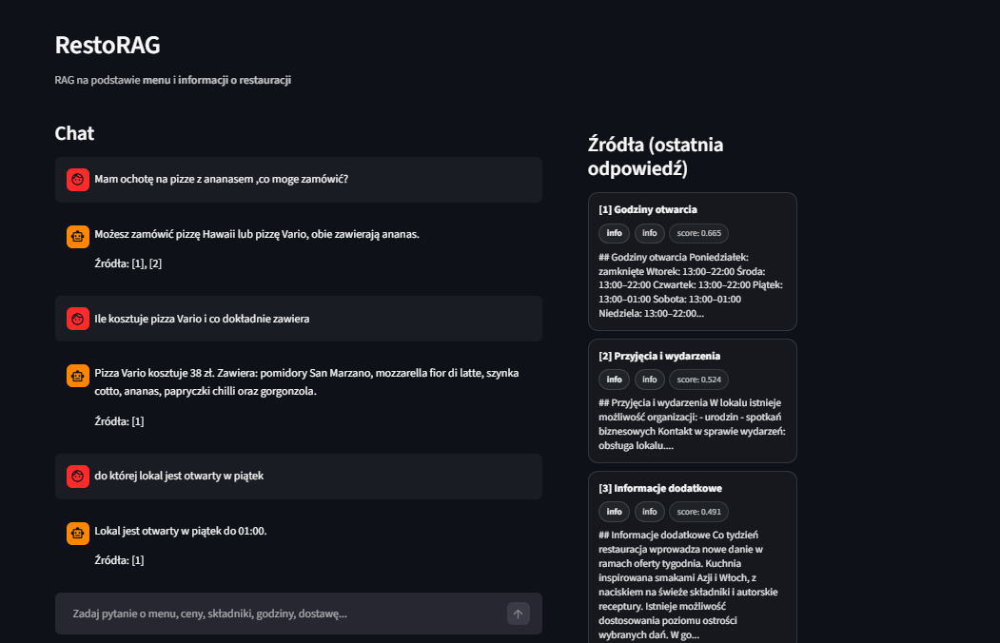

# RestoRAG 

## Opis projektu
RestoRAG to edukacyjna aplikacja typu RAG (Retrieval-Augmented Generation), która odpowiada na pytania użytkownika na podstawie lokalnych danych restauracji.

Źródłem wiedzy są pliki Markdown zawierające:
- menu restauracji
- informacje organizacyjne (godziny, dostawa, rezerwacje, udogodnienia)

Aplikacja działa lokalnie, bez Dockera i bez zewnętrznej bazy wektorowej.  
Wyszukiwanie semantyczne realizowane jest przy użyciu FAISS, a odpowiedzi generowane są z wykorzystaniem OpenAI API.

## Funkcjonalności
- Chat Q&A w języku polskim
- Pytania o ceny, składniki, menu, godziny otwarcia, dostawę
- Wyszukiwanie semantyczne (embeddings + FAISS)
- Panel „Źródła” pokazujący fragmenty danych użyte do odpowiedzi
- Brak odpowiedzi spoza dostępnych danych (brak halucynacji)

## Jak działa aplikacja
1. Dane źródłowe zapisane w plikach Markdown (`data/`)
2. Chunking – dzielenie danych na logiczne fragmenty (sekcje, dania)
3. Generowanie embeddingów dla chunków
4. Zapis do lokalnego indeksu FAISS
5. Zapytanie użytkownika:
   - embedding pytania
   - retrieval najbardziej pasujących fragmentów
   - generowanie odpowiedzi na podstawie kontekstu
6. Prezentacja odpowiedzi i źródeł w aplikacji Streamlit


## Wymagania

Python 3.10+

Konto OpenAI (klucz API)

## Instalacja

Sklonuj repozytorium.

Zainstaluj zależności:
```
pip install -r requirements.txt
```

Utwórz plik .env na podstawie .env.example i uzupełnij klucz API.

Przykład .env:
```
OPENAI_API_KEY=YOUR_API_KEY
OPENAI_EMBED_MODEL=text-embedding-3-small
OPENAI_CHAT_MODEL=gpt-4o-mini
```
## Budowa indeksu

Przed pierwszym uruchomieniem aplikacji należy zbudować lokalny indeks wektorowy:

python scripts/build_index.py


Folder index/ jest generowany lokalnie i ignorowany przez Git.

Uruchomienie aplikacji
streamlit run app/main.py

## Przykładowe pytania

Ile kosztuje Margherita?

Jakie są sosy do pizzy?

Czy restauracja oferuje dostawę?

Ile trwa średni czas dostawy?

Czy można wejść do lokalu z psem?

Do której godziny lokal jest otwarty w piątek?

Co zawiera Tantanmen?

## Zrzuty ekranu



## Nota

Projekt edukacyjny 
Dane restauracji wykorzystywane wyłącznie w celach demonstracyjnych.
